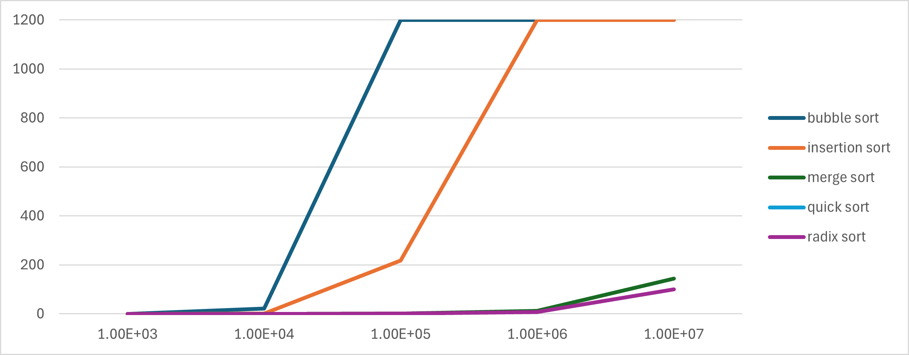
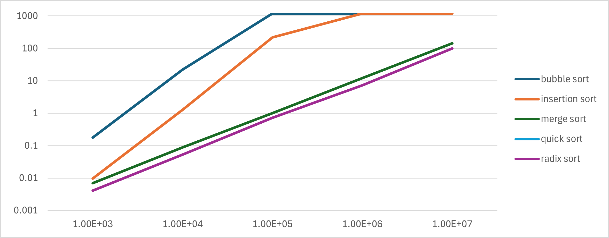

# Python implementations of sorting algorithms

## Sorting Algorithms Implemented
+ Bubble Sort
+ Insertion Sort
+ Merge Sort
+ Quick Sort
+ Radix Sort

## How to use these implementations
```
git clone https://github.com/wskertic/dsa.git .

cd dsa/assignments/m3-sorting/skert-sort

nano -w __main__.py (to edit values supplied and algorithms run)

python __main__.py
```
Changes the values of `test_sizes` and `test_runs` to change the sizes of random int sets are sorted and how many times.

| Algorithm Mean Time for Input Size | 1.00E+03 | 1.00E+04 | 1.00E+05  | 1.00E+06  | 1.00E+07  |
|--------------------------------------|----------|----------|-----------|-----------|-----------|
| bubble sort                          | 0.1760 s | 22.329 s | &gt; 20 m | &gt; 20 m | &gt; 20 m |
| insertion sort                       | 0.0096 s | 1.2722 s | 3.619 m   | &gt; 20 m | &gt; 20 m |
| merge sort                           | 0.0069 s | 0.0879 s | 1.0010 s  | 12.022 s  | 144.29 s  |
| quick sort                           | 2.5E-07  | 2.25E-07 | 2.5E-07   | 2.75E-07  | 7E-07     |
| radix sort                           | 0.0041 s | 0.0528 s | 0.7215 s  | 7.3127 s  | 99.691 s  |
| radix sort                           | 0.0041 s | 0.0528 s | 0.7215 s  | 7.3127 s  | 99.691 s  |

## Summary findings

There is clear an nearly immediate separation of sorting algorithms with respect to run time as the number of elements to be sorted goes from 1e4 to 1e5.

Looking at the values associated with the runs for these implementations of each algorithm, I would have liked to spend more time investigating the reason quick sort is so much faster than the others. It appears at first glance there may be somthing wrong with the implementation or how it is called for testing that is leading to consistently near zero run times.


### Linear Scale Run Time Comparison


### Log Scale Run Time Comparison
